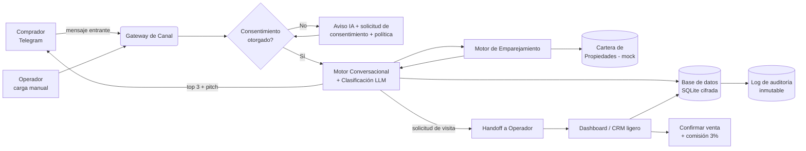

# SRS — Vendedor Virtual Inmobiliario (VVI)
### Software Requirements Specification · MVP 72h

| Campo | Valor |
|---|---|
| Sistema | Vendedor Virtual Inmobiliario (VVI) |
| Versión | 1.0 (MVP) |
| Build tool | Claude Code |
| Runtime LLM | Kimi K2.6 (`api.moonshot.ai/v1`) — Claude como fallback |
| Backend | Python 3.11+ · FastAPI |
| Bot | `python-telegram-bot` (Telegram Bot API) |
| Almacenamiento | SQLite + cifrado de campo (Fernet) |
| Documento relacionado | Ver PRD y ADR |

> **Aviso legal.** Los controles de cumplimiento aquí descritos deben validarse con asesoría jurídica colombiana antes de producción.

---

## 1. Arquitectura del sistema

### 1.1 Diagrama de alto nivel



### 1.2 Descripción del flujo
`Entrada (Telegram/manual) → Verificación de consentimiento → Conversación + clasificación (LLM) → Persistencia cifrada → Emparejamiento contra cartera → Respuesta al comprador → Handoff al operador → Confirmación de venta + comisión`. Toda operación sobre datos personales deja traza en el log de auditoría.

---

## 2. Módulos principales

### 2.1 Gateway de Canal (`channel_gateway`)
- **Función:** recibir/enviar mensajes. MVP: Telegram (webhook o long-polling) + endpoint de carga manual.
- **Entradas:** update de Telegram, o POST manual `{canal, texto, contacto?}`.
- **Salidas:** evento normalizado `IncomingMessage`.
- **Validación ética:** ningún mensaje **saliente** se despacha si el prospecto no tiene consentimiento vigente (RF-19). El primer contacto siempre lo inicia el comprador.

### 2.2 Motor Conversacional + Clasificación (`nlu_engine`)
- **Función:** conversar, extraer datos e inferir intención con LLM (Kimi K2.6). Híbrido **reglas + LLM** (ver ADR-03).
- **Qué extrae (slots):** `ciudad`, `zona`, `tipo`, `presupuesto_min`, `presupuesto_max`, `habitaciones`, `plazo_compra`, `contacto_pref`.
- **Qué clasifica:** `score_intencion` (0–100) y `etiqueta` (`frío`/`tibio`/`caliente`).
- **Reglas duras (sin LLM):** si no hay ciudad ∈ {Medellín, Pereira} o presupuesto < mínimo de cartera → marca `fuera_de_alcance`.
- **Salida:** JSON estructurado (ver §4) + texto de respuesta.

### 2.3 Motor de Emparejamiento (`matching_engine`)
- **Función:** filtrar la cartera y rankear.
- **Filtros:** `ciudad == perfil.ciudad`, `tipo == perfil.tipo`, `precio ∈ [presupuesto_min, presupuesto_max]`, `habitaciones >= perfil.habitaciones`.
- **Ranking:** cercanía de precio al tope del presupuesto + match de zona.
- **Salida:** top 3 propiedades + frase de venta generada por LLM (honesta, sin inventar).

### 2.4 Gestión de Cartera (`portfolio`)
- **Función:** CRUD de propiedades. MVP con **datos mockeados** (seed JSON → SQLite).
- **Operaciones:** crear, listar, actualizar, inactivar.

### 2.5 CRM ligero + Dashboard (`dashboard`)
- **Función:** vista de prospectos (estado, score, canal), solicitudes de visita, confirmación de venta y comisión.
- **Tecnología MVP:** FastAPI + plantillas Jinja2/HTMX (server-rendered). Sin SPA compleja.
- **Acción crítica:** botón "Confirmar venta" → captura `precio_venta` → calcula `comision = precio × 0.03`.

### 2.6 Consentimiento y Auditoría (`compliance`)
- **Función:** capturar consentimiento, cifrar PII, registrar auditoría.
- **Consentimiento:** guarda `texto_autorizacion`, `timestamp`, `canal`, `version_politica`.
- **Cifrado:** campos de contacto cifrados con Fernet; clave en variable de entorno.
- **Auditoría:** append-only; registra `actor`, `accion`, `id_prospecto`, `timestamp`.

---

## 3. Flujos de datos (input → proceso → output)

| # | Input | Proceso | Output |
|---|---|---|---|
| DF-1 | Mensaje entrante de comprador | Normalización → check consentimiento | `IncomingMessage` o solicitud de consentimiento |
| DF-2 | Texto conversacional | LLM extrae slots + score | JSON de perfil + respuesta |
| DF-3 | Perfil completo | Filtro + ranking sobre cartera | Top 3 propiedades |
| DF-4 | Solicitud de visita | Crea tarea de handoff | Notificación al operador |
| DF-5 | "Confirmar venta" + precio | Cálculo 3% + atribución | Registro de comisión |
| DF-6 | Cualquier acción sobre PII | Escritura append-only | Entrada de auditoría |

---

## 4. Estructuras de datos (ejemplos concretos)

### 4.1 Propiedad (cartera mock)
```json
{
  "id": "PROP-MED-001",
  "ciudad": "Medellín",
  "zona": "Laureles",
  "tipo": "apartamento",
  "habitaciones": 3,
  "banos": 2,
  "area_m2": 92,
  "precio": 520000000,
  "estado": "disponible",
  "descripcion": "Apto remodelado, iluminado, cerca del Estadio.",
  "foto_url": "https://placeholder.local/prop-med-001.jpg"
}
```

### 4.2 Perfil del prospecto (salida del clasificador)
```json
{
  "id_prospecto": "LEAD-000123",
  "canal": "telegram",
  "consentimiento": true,
  "consentimiento_ts": "2026-08-08T14:22:10-05:00",
  "ciudad": "Pereira",
  "zona": "Pinares",
  "tipo": "casa",
  "presupuesto_min": 300000000,
  "presupuesto_max": 450000000,
  "habitaciones": 3,
  "plazo_compra": "1-3 meses",
  "score_intencion": 82,
  "etiqueta": "caliente",
  "estado": "calificado"
}
```

### 4.3 Registro de venta / comisión
```json
{
  "id_venta": "SALE-0007",
  "id_prospecto": "LEAD-000123",
  "id_propiedad": "PROP-PER-004",
  "canal_origen": "telegram",
  "precio_venta": 420000000,
  "comision_pct": 0.03,
  "comision_valor": 12600000,
  "operador": "op_marta",
  "fecha": "2026-08-20T16:40:00-05:00"
}
```

### 4.4 Salida JSON del clasificador (contrato con el LLM)
Prompt del sistema debe exigir **solo JSON**, sin markdown:
```json
{
  "slots": {
    "ciudad": "Medellín|Pereira|null",
    "tipo": "casa|apartamento|lote|null",
    "presupuesto_min": 0,
    "presupuesto_max": 0,
    "habitaciones": 0,
    "plazo_compra": "string|null"
  },
  "score_intencion": 0,
  "etiqueta": "frío|tibio|caliente",
  "faltan_datos": ["presupuesto_max"],
  "respuesta_sugerida": "texto para el comprador"
}
```

---

## 5. Interfaces externas

### 5.1 LLM (Kimi K2.6 — compatible OpenAI)
- **Endpoint:** `POST https://api.moonshot.ai/v1/chat/completions`
- **Modelo:** `kimi-k2.6` (mid-tier económico) · fallback: Claude vía Anthropic API.
- **Modo:** `response_format` JSON + `temperature` baja para clasificación.
- **Auth:** bearer key en variable de entorno `MOONSHOT_API_KEY`.
- **Claude Code:** se usa para **construir** el sistema; el app en runtime puede llamar a Kimi o a Claude.

### 5.2 Telegram Bot API
- **Auth:** `TELEGRAM_BOT_TOKEN` (BotFather).
- **Modo MVP:** long-polling (más simple) o webhook si hay dominio con TLS.

### 5.3 Interfaces Fase 2 (no MVP)
- WhatsApp Cloud API (Graph), Meta Lead Ads webhook, Mercado Libre API de preguntas, SMTP/email. Todas **opt-in / inbound**.

---

## 6. Seguridad y cumplimiento

| Control | Implementación MVP |
|---|---|
| Consentimiento previo (Art. 9 Ley 1581) | Aviso de IA + solicitud de autorización en el **primer** mensaje; sin aceptación no se persiste PII. |
| Aviso de privacidad | Enlace a política de tratamiento entregado en el consentimiento. |
| Transparencia | El bot se identifica como IA explícitamente (RF-04). |
| Cifrado en reposo | Fernet sobre nombre/teléfono/usuario. |
| Cifrado en tránsito | TLS en todos los endpoints. |
| Minimización | Solo se piden datos necesarios para calificar y contactar. |
| Log de auditoría | Append-only con actor, acción, timestamp. |
| Bloqueo de contacto no consentido | El gateway rechaza salientes sin consentimiento (RF-19). |
| Secretos | API keys en variables de entorno, nunca en el repo. |
| Retención | Política de retención documentada; borrado a solicitud (Fase 2, RF-20). |
| No scraping | El sistema **no** ingiere datos personales de redes sin opt-in (ADR-01). |

> **Reforma 2025–2026:** la actualización de la Ley 1581 en trámite refuerza el consentimiento, incorpora el derecho a **no ser objeto de decisiones automatizadas** y eleva sanciones (hasta 10.000 SMMLV o 5% de ingresos). El gate humano de venta (ADR-05) se alinea con ese derecho. Verificar texto vigente con abogado.

---

## 7. Limitaciones técnicas (MVP 72h)

- **Un solo canal** (Telegram). WhatsApp queda fuera por tiempos de verificación de Meta (3–10 días hábiles).
- **Cartera mock**, no sincronizada con portales.
- **Sin ML entrenado**: clasificación por reglas + LLM zero/few-shot.
- **Rate limits**: Kimi limita por tier de recarga; Telegram ~30 msg/s por bot. Suficiente para piloto.
- **Escala**: SQLite adecuado para piloto (cientos–miles de prospectos), no para alta concurrencia.
- **Sin agenda automática de visitas** (handoff es notificación, no calendario).

---

## 8. Casos de uso end-to-end

### CU-1 — Comprador califica y recibe opciones
1. Comprador escribe al bot en Telegram.
2. Bot se identifica como IA y pide consentimiento → comprador acepta.
3. Bot pregunta ciudad, tipo, presupuesto, plazo.
4. Clasificador arma perfil + score (p. ej. 82, "caliente").
5. Motor de emparejamiento devuelve top 3 propiedades con pitch.
6. Perfil y consentimiento quedan persistidos y cifrados.

### CU-2 — Handoff a asesor humano
1. Comprador pide visita a la propiedad `PROP-PER-004`.
2. Sistema crea tarea de handoff y notifica al operador.
3. Operador ve en el dashboard: datos, score, propiedad, historial.
4. Estado del prospecto pasa a `visita`.

### CU-3 — Confirmación de venta y comisión
1. Operador cierra la venta fuera del sistema (visita/negociación).
2. En el dashboard marca "Confirmar venta" e ingresa `precio_venta = 420.000.000`.
3. Sistema calcula `comisión = 12.600.000` (3%) y registra atribución.
4. Estado → `vendido`; queda en métricas y auditoría.

### CU-4 — Prospecto fuera de alcance
1. Comprador busca en Cali con presupuesto muy bajo.
2. Reglas duras marcan `fuera_de_alcance`.
3. Bot responde con transparencia que hoy solo cubre Medellín/Pereira y no fuerza el contacto.

---

## 9. Ejemplos concretos para acelerar desarrollo

### 9.1 "Queries" de emparejamiento (equivalente compliant a la búsqueda)
> Nota: no se hacen "queries de scraping" en redes. La búsqueda es **interna** contra la cartera + Fase 2 con audiencias opt-in.

**SQL de matching (cartera):**
```sql
SELECT * FROM propiedades
WHERE ciudad = :ciudad
  AND tipo = :tipo
  AND estado = 'disponible'
  AND precio BETWEEN :presupuesto_min AND :presupuesto_max
  AND habitaciones >= :habitaciones
ORDER BY ABS(precio - :presupuesto_max) ASC
LIMIT 3;
```

**Fase 2 — targeting de audiencia opt-in (Meta Lead Ads, no scraping):** segmentar por ubicación (Medellín/Pereira), intereses (bienes raíces, mudanza) y formulario con casilla de consentimiento; los datos llegan por webhook **con autorización del usuario**.

### 9.2 Plantillas de contacto (solo tras consentimiento)

**Primer mensaje (obligatorio: identificación IA + consentimiento):**
> "¡Hola! 👋 Soy un *asistente virtual con IA* de [Inmobiliaria]. Te puedo ayudar a encontrar casa, apto o lote en Medellín o Pereira. Para continuar necesito tu permiso para tratar tus datos según nuestra política de privacidad [enlace]. ¿Autorizas? (Sí/No)"

**Calificación:**
> "¡Genial! Para mostrarte lo mejor: ¿en qué *ciudad y zona* buscas, qué *tipo* (casa/apto/lote) y cuál es tu *presupuesto* aproximado?"

**Presentación de matches:**
> "Con eso en mente, te dejo 3 opciones que encajan:
> 1) {zona} — {tipo} de {habitaciones} hab · ${precio} — {frase_venta}
> ¿Quieres agendar una visita o hablar con un asesor?"

**Fuera de alcance (honesto):**
> "Por ahora solo manejo propiedades en Medellín y Pereira, así que no quiero hacerte perder tiempo. Si te sirve, te aviso cuando ampliemos zona."

### 9.3 Prompt de sistema del clasificador (extracto)
> "Eres un asistente inmobiliario. Responde SIEMPRE en español colombiano, en mensajes cortos. Nunca inventes propiedades ni precios; usa solo la cartera provista. Devuelve SIEMPRE un objeto JSON válido con los campos {slots, score_intencion, etiqueta, faltan_datos, respuesta_sugerida} y NADA más (sin markdown, sin texto adicional)."

---

## 10. Tecnologías recomendadas

| Capa | Recomendación MVP | Por qué |
|---|---|---|
| Build | **Claude Code** | Genera y ejecuta el scaffolding en horas |
| Lenguaje/API | Python 3.11 + FastAPI | Rápido, ecosistema maduro |
| Bot | `python-telegram-bot` | Estándar, long-polling sin infra |
| LLM runtime | **Kimi K2.6** (OpenAI-compatible) | Barato, JSON mode, tool calls; Claude como fallback |
| DB | SQLite | Gratis, local, cero-config (ADR-04) |
| Cifrado | `cryptography` (Fernet) | Simple y suficiente para PII en MVP |
| Dashboard | FastAPI + Jinja2/HTMX | Mínimo esfuerzo, server-rendered |
| Config | `.env` / variables de entorno | Secretos fuera del repo |
